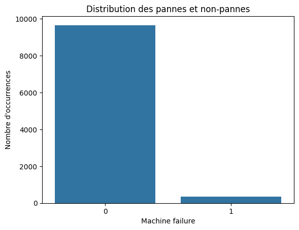
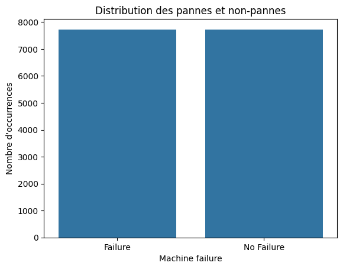
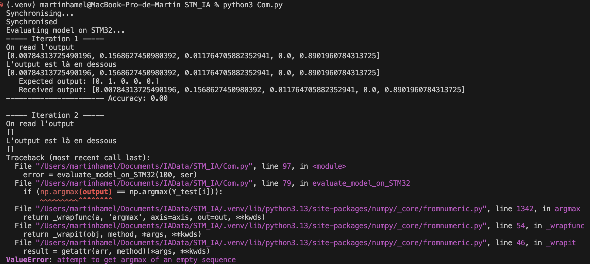
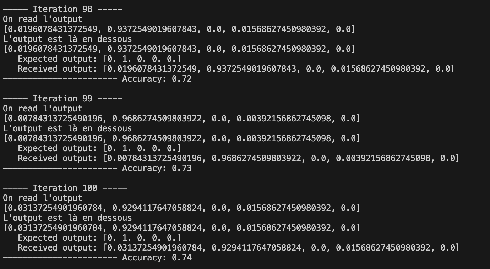

# Rapport - IA Embarquée

## Martin HAMEL  & Amaury MIQUEL  

### Développement d’un réseau de neurones pour la maintenance prédictive

---

## Introduction

Ce projet s'inscrit dans le cadre du déploiement d'un réseau de neurones profonds (DNN) pour la **maintenance prédictive**. Il se divise en **trois grandes étapes** :

1. **Conception et entraînement du modèle** sur un fichier Google Colab.
2. **Exportation et intégration du modèle** dans **STM32CubeIDE**.
3. **Communication avec la carte STM32L4R9**, à l’aide d’un script Python.

---
### Organisation du projet
Afin d'organiser le travail de ce projet, nous avons décidé de le découper en plusieurs dossiers qui répertorie les différentes parties du projet: 
- Dossier pour les fichiers h5
- Dossier Colab
- Dossier STM32
- Dossier Communication Python-STM32

## Description des dossiers

 ### Dossier pour les fichiers h5
Ce dossier permet de stocker les fichiers en extension .h5 ainsi que les données d'entraînement. Il contient deux fichiers:

- Le modèle entraîné sur Google Colab sous format h5
- Les données d'entraînement sous format npy

Le fichier .h5 comprend l'architecture du modèle ainsi que les pondérations du modèle entrainé sous Colab. Cette structure permet ainsi de fournir ce modèle à d'autres applications afin d'éviter les phases d'entrainement. Dans notre cas, ce fichier est utilisé pour implémenter l'architecture et les pondérations de notre modèle au sein de la carte embarqué pour contourner la phase d'entrainement.

 ### Dossier Colab
Ce dossier contient :

- Le fichier Colab
- Les données d'entraînement brutes

Le fichier Colab nous a permis de construire le modèle adéquat correspondant aux données fournies pour développer le projet.

 ### Dossier STM32

Ce dossier contient l'intégralité de l'arbosence du projet STM32 afin d'entraîner le modèle sur la carte Embarqué. Les fichiers les plus importants sont: 
 - Main.c permettant d'éxécuter le modèle
 - app_x_cube_ai.c contenant tous les codes pour acquérir les données et les traiter.

### Dossier Communication Python-STM32

Ce dossier contient les fichiers de communication entre la carte STM32 ainsi que le PC pour transmettre les résultats obtenus.

##  Partie 1 - Développement sur Google Colab

L’objectif de cette première étape est de **créer un modèle capable de prédire les défaillances de machines industrielles à partir de leurs conditions de fonctionnement**.

###  Analyse des données d'entraînement

Les conditions de fonctionnement sont définies par plusieurs paramètres :
- Température de l'air
- Température du processus
- Couple
- Taux de rotation
- Usure des outils

À partir de ces données, le but est de prédire **si la machine est en défaillance ou non**, et **d’identifier le type d’erreur** en cas de dysfonctionnement.

Suite à l'identification des labels ainsi que des entrées, nous avons souhaité connaître la répartition des données entre les machine en état de fonctionnment et celles dysfonctionnelles. Cette étape est cruciale dans le developpement d'un modèle d'intelligence artificielle car il est nécéssaire que les données soient correctement réparties afin d'éviter des problèmes d'overfitting ou d'underfitting.



Cette répartion souligne par conséquence une disparité de répartition entre les machines que nous devrons régler dans la suite du projet pour éviter des problèmes d'overfitting ou d'underfitting.

###  Répartion des données

Afin de résoudre ce problème, nous avons mis en place des méthodes afin de résoudre ce problème de répartition des données.
Pour ce faire, nous avons souhaité utiliser la méthode SMOTE consistant à générer des échantillons de la classe minoritaire. Cette méthode nous a permis de générer la répartition suivante:




###  Construction du Modèle d'apprentissage

Après avoir construit un dataset équilibré, nous avons construit un **MLP (Multi-Layer Perceptron) simple** avec la bibliothèque Tensorflow pour atteindre l'objectif fixé à savoir la détection et l'identification de défaillance :

```python
model = Sequential([
    Dense(128, input_dim=X_train.shape[1], activation='relu'),
    Dropout(0.05),
    Dense(64, activation='relu'),
    Dropout(0.05),
    Dense(32, activation='relu'),
    Dense(5, activation='sigmoid')
])
```
Ce modèle composé de couche Dense ou Fully Connected, nous a permis d'atteindre une précision de 75 % en évitant les problèmes d'overfitting ou d'underefitting.


##  Partie 2 - Exportation et intégration du modèle

Suite au développement du modèle sous python, nous avons exporté ce modèle sous le format.h5 afin de l'exploiter sous STM32. Le format h5 permet de stocker de grandes quantités de données (architecture, pondération) dans un seul fichier, ce qui nous est utile dans notre cas.
Ensuite, sur le logiciel STM32CubeIDE, nous créons un nouveau projet se basant sur la carte SMT32L4R9 que nous utilisons. Afin d'intégrer le modèle dans notre carte nous ajoutons l'extension "X_Cube_AI" au projet. Cette extension nous permet d'évaluer, de compiler et d'optimiser des modèles IA pour les micro-contrôleurs STM32. Dans notre cas, nous utilisons le modèle que nous avons entraîné dans le projet Colab. Nous analysons ce modèle sur le logiciel STM32CubeIDE, puis nous utilisons les codes fournis sur Ecampus pour développer la communication entre la carte et le logiciel.

```c
/* USER CODE BEGIN includes */
extern UART_HandleTypeDef huart2;
#define BYTES_IN_FLOATS 28*28*4
#define TIMEOUT 1000
#define SYNCHRONISATION 0xAB
#define ACKNOWLEDGE 0xCD
#define CLASS_NUMBER 10
 void synchronize_UART(void);
/* USER CODE END includes */
void synchronize_UART(void)
{
    bool is_synced = 0;
    unsigned char rx[2] = {0};
    unsigned char tx[2] = {ACKNOWLEDGE, 0};
    while (!is_synced)
    {
      HAL_UART_Receive(&huart2, (uint8_t *)rx, sizeof(rx), TIMEOUT);
      if (rx[0] == SYNCHRONISATION)
      {
        HAL_UART_Transmit(&huart2, (uint8_t *)tx, sizeof(tx), TIMEOUT);
        is_synced = 1;
      }
    }
    return;
}
void MX_X_CUBE_AI_Process(void)
{
    /* USER CODE BEGIN 6 */
  int res = -1;
  uint8_t *in_data = ai_input[0].data;
  uint8_t *out_data = ai_output[0].data;
  synchronize_UART();
  if (colab) {
    do {
      /* 1 - acquire and pre-process input data */
      res = acquire_and_process_data(in_data);
      /* 2 - process the data - call inference engine */
      if (res == 0)
        res = ai_run();
      /* 3- post-process the predictions */
      if (res == 0)
        res = post_process(out_data);
    } while (res==0);
  }
  if (res) {
    ai_error err = {AI_ERROR_INVALID_STATE, AI_ERROR_CODE_NETWORK};
    ai_log_err(err, "Process has FAILED");
  }
    /* USER CODE END 6 */
}
```

Ces lignes de codes nous permettent d'abord de nous connecter à la carte (void synchronize_UART()). En effet, l'échange de données via UART entre les deux périphériques se doit d'être le plus synchrone possible pour éviter les pertes ou la corruption des données. Ensuite, lorsque le logiciel reçoit les données de la carte, celui-ci les traite (int acquire_and_process_data(ai_i8* data[])). Cette fonction extrait les données reçues par le logiciel puis les convertit en float pour que le modèle IA puisse les utiliser. Une fois traitées par le modèle, STM32CubeIDE envoie les résultats à la carte sous la forme uint8_t grâce à la fonction int post_process(ai_i8* data[]). Du côté de la carte, le fichier code en python Com.py permet d'assurer la communication depuis la carte. Si l'on développe autant de fonctions pour la communication, c'est parce que l'UART n'échange que des données sous la forme d'octets. Or, sur le logiciel CubeIDE, les données sont traitées sous la forme de bytes. Aisni, il faut à chaque échange convertir les données pour garantir le bon fonctionnement de l'échange. 
Techniquement, la synchronisation entre la carte et CubeIDE repose sur la vérification de l'état du booléen is_synced. Celui-ci peut-être true si et seulement si le logiciel reçoit de la carte la donnée 0xAB et lui renvoie avec succès la donnée 0xCD. Si tel est le cas, alors les deux périphériques sont bien synchronisés. Une fois les deux périphériques synchronisés, CubeIDE stocke les données reçues et envoyées dans des mémoires tampon gérées dynamiquement. Les fonctions acquire_and_process_data et post_process se charge des opérations de récupération des données, de prédictions et leur envoi à la carte. Il y a un envoi d'erreur si la variable res prend la valeur 1.
Enfin, la fonction ai_run calcule les prédictions du modèle.

```c
int acquire_and_process_data(ai_i8 *data[])
{
    //
    // 1. Variables for data acquisition
    //
    unsigned char tmp[BYTES_IN_FLOATS] = {0};
    int num_elements = sizeof(tmp) / sizeof(tmp[0]);
    int num_floats = num_elements / 4;
    //
    // 2. Receive data from UART
    //
    HAL_StatusTypeDef status = HAL_UART_Receive(&huart2, (uint8_t *)tmp, sizeof(tmp), TIMEOUT);
    // Check the return status of HAL_UART_Receive
    if (status != HAL_OK)
    {
      printf("Failed to receive data from UART. Error code: %d\n", status);
      return (1);
    }
    //
    // 3. Reconstruct floats from bytes
    //
    if (num_elements % 4 != 0)
    {
      printf("The array length is not a multiple of 4 bytes. Cannot reconstruct floats.\n");
      return (1);
    }
    for (size_t i = 0; i < num_floats; i++)
    {
      unsigned char bytes[4] = {0};
      // Reconstruction of the bytes
      for (size_t j = 0; j < 4; j++)
      {
        bytes[j] = tmp[i * 4 + j];
      }
      // Store the bytes in 'data'
      for (size_t k = 0; k < 4; k++)
      {
        ((uint8_t *)data)[(i * 4 + k)] = bytes[k];
      }
    }
    return (0);
}
int post_process(ai_i8 *data[])
{
    //
    // Get the output data
    //
    if (data == NULL)
    {
      printf("The output data is NULL.\n");
      return (1);
    }
    uint8_t *output = data;
    // An array to store the float outputs
    float outs[CLASS_NUMBER] = {0.0};
    uint8_t outs_uint8[CLASS_NUMBER] = {0};
    /* Convert the probability to float */
    for (size_t i = 0; i < CLASS_NUMBER; i++)
    {
      uint8_t temp[4] = {0};
      // Extract 4 bytes to reconstruct a float
      for (size_t j = 0; j < 4; j++)
      {
        temp[j] = output[i * 4 + j];
      }
      // Reconstruct the float from the bytes
      outs[i] = *(float *)&temp;
      // Convert the float to uint8_t for UART transmission
      outs_uint8[i] = (char)(outs[i] * 255);
    }
    //
// Transmit the output data
//
HAL_StatusTypeDef status = HAL_UART_Transmit(&huart2, (uint8_t *)outs_uint8, sizeof(outs_uint8), TIMEOUT);
// Check the return status of HAL_UART_Transmit
if (status != HAL_OK)
{
printf("Failed to transmit data to UART. Error code: %d\n", status);
return (1);
}
return 0;
}
```

Les fonctions acquire_and_process_data et post_process fonctionnent ainsi : d'abord, comme dit précédemment il faut convertir les données reçues en floats en bytes. Si STM32CubeIDE reçoit correctement les données de la carte, alors commence le dépôt de ces dernières dans le tableau tmp. La conversion en bytes se fait au niveau de la boucle for (le tableau bytes), puis les données converties sont stockées dans la variable data.
Enfin, la fonction post_process s'occupe de renvoyer ces données sous forme de floats à la carte.

##  Partie 3 - Communication avec la carte STM32L4R9

Du côté de la carte, le programme Com.py assure la communication entre les deux périphériques. Tout d'abord, le fichier sélectionne le port de communication depuis lequel l'échange aura lieu. Puis, la carte micro-contrôleur envoie une donnée en hexadécimal 0xAB au logiciel. La synchronisation commence lorsque celle-ci reçoit du logiciel la donnée 0xCD.
Pour que la communication ait lieu, il faut d'abord debugger et exécuter le code C sur STM32CubeIDE, puis exécuter le code Python Com.py. Il y a alors synchronisation entre la carte et l'ordinateur et l'entraînement peut alors débuter.
Tout au long de l'échange, la carte va évaluer les prédictions émises par le modèle IA du logiciel, elle va en outre calculer sa précision à partir des données chargées sur la carte. Ces données correspondent aux entrées et sorties test attendues. Enfin, on peut lire la précision finale du modèle au bout de la centième itération.
Dans le bloc principal du programme, la carte charge les données tests puis se synchronise avec STM32CubeIDE, avant de tester le modèle pendant une centaine d'itérations.

Lors de notre phase de test du modèle exporté nous avons rencontré un problème technique. En effet, la carte fournie n'arrivait pas à échanger avec le logiciel, nous avions toujours la première itération d'effectuée mais tout de suite nous rencontrions une erreur nous précisant que les données étaient vides.



Après avoir changé de carte avec une autre très proche, nous avons trouvé un résultat de précision de 74% au bout de la centième itération. Nous pensons cette précision satisfaisant compte tenu des résultats obtenus précédemment sur le fichier Colab et de la faible densité des données à notre disposition.

